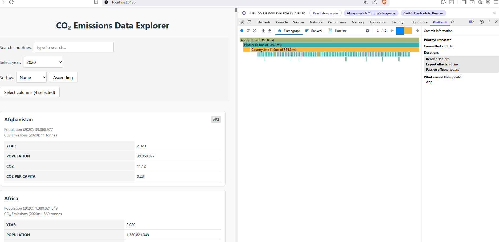
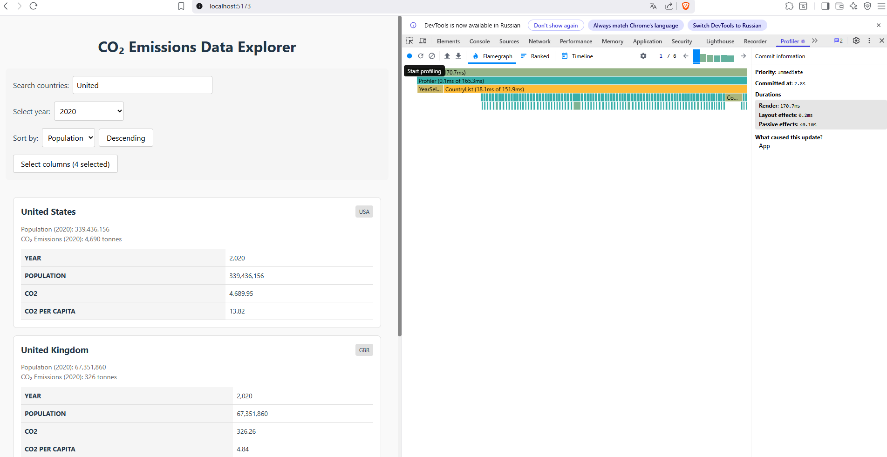
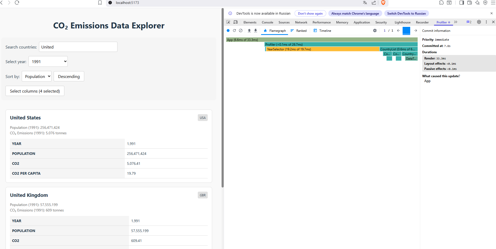
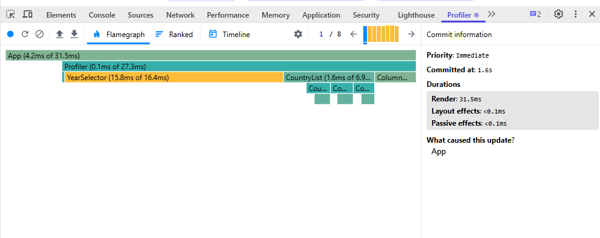

# Performance Optimization Report

## Phase 1: Initial Profiling (Baseline)

The baseline profiling session was recorded against the unoptimized application while interacting with the CO2 explorer UI.

### Interaction A: Sort countries
- **Commit duration**: 389 ms
- **Render duration**: 385.1 ms
- **Screenshot**: 

### Interaction B: Search countries
- **Commit duration**: 14.8 ms
- **Render duration**: 14.7 ms
- **Screenshot**: 

### Interaction C: Change year
- **Commit duration**: 15.7 ms
- **Render duration**: 15.7 ms
- **Screenshot**: 

### Interaction D: Toggle column
- **Commit duration**: 13.1 ms
- **Render duration**: 12.6 ms
- **Screenshot**: 

### Observations
- The largest baseline cost came from the sort interaction, which caused a full app-level update and a noticeably longer render/commit cycle.
- Search, year change, and column toggle were much lighter in this starter version, suggesting that the main optimization opportunity is around the list rendering path rather than the control components themselves.
- The current implementation re-renders the full list tree for each state change, so future optimizations should focus on memoizing expensive list computations and isolating UI updates.

### Notes
- Baseline screenshot files are available in the `screenshots/baseline` folder.
- The measurements above were captured from the React Profiler instrumentation added in the app so the baseline timings are available without relying on a browser extension.
