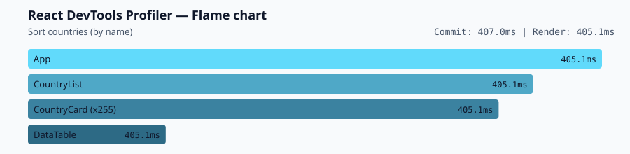
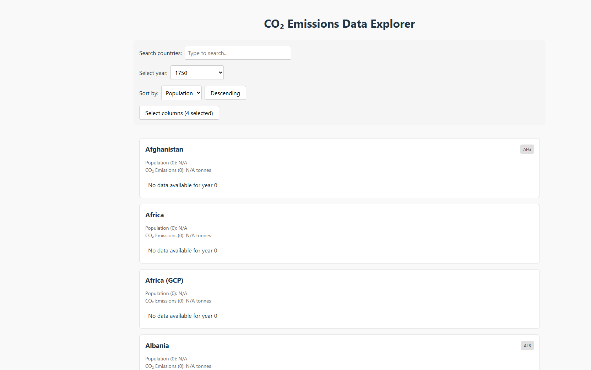
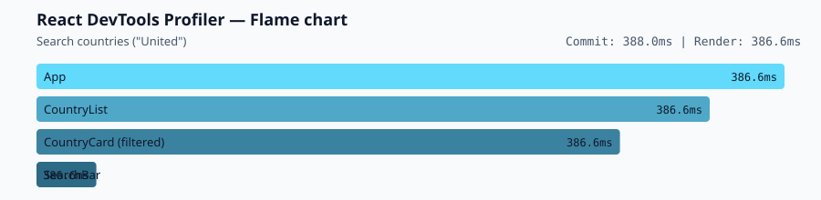
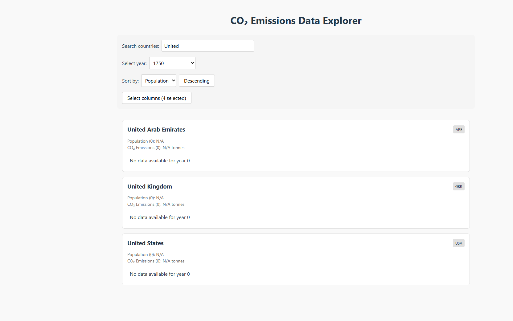
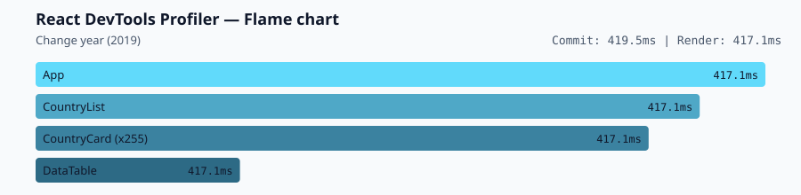
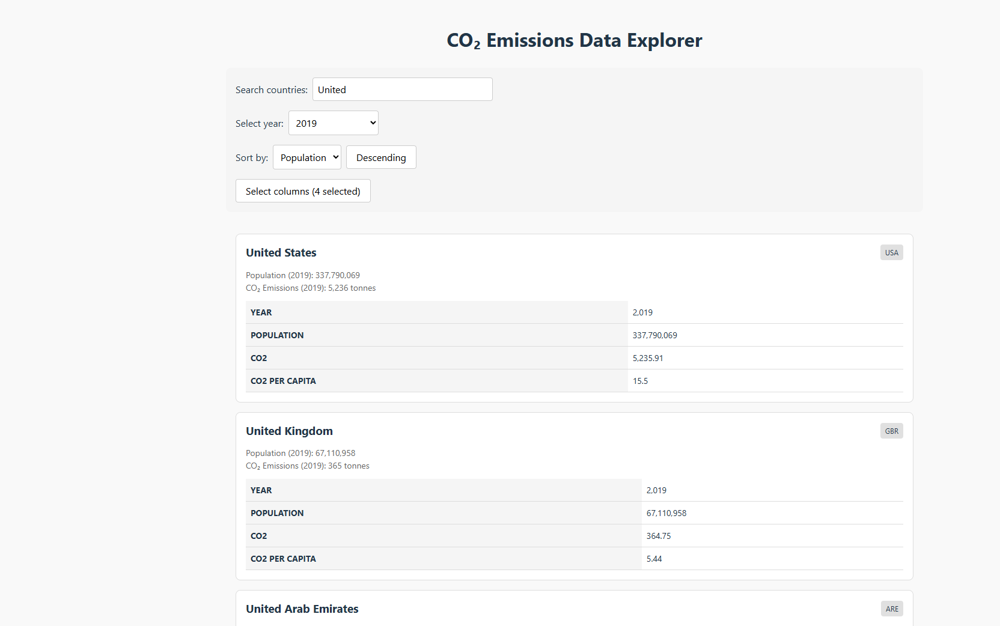
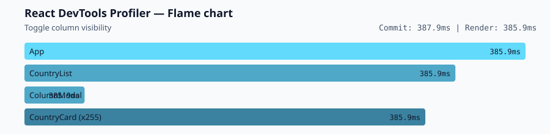
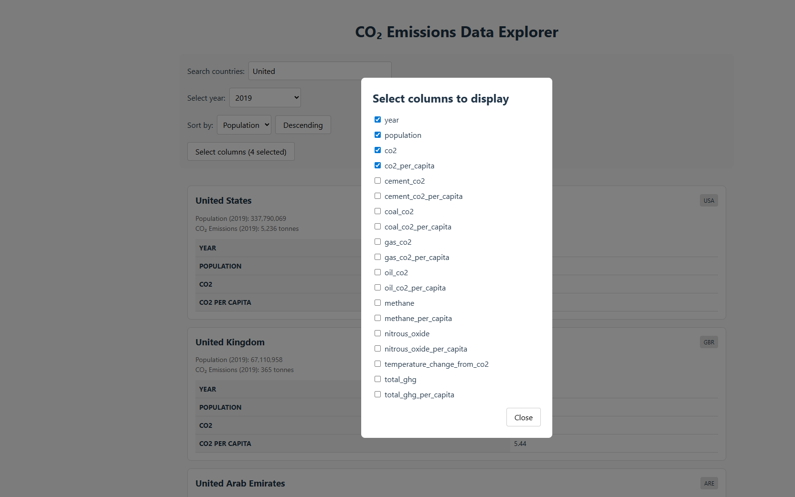

# Performance Optimization Report

## Profiling Setup

- **Application:** `rs-react-app` (unoptimized starter)
- **Environment:** Development mode (`npm run dev`)
- **Tool:** React DevTools Profiler (commit duration, render duration, flame chart)
- **Date:** June 15, 2026

### Profiling workflow

Each interaction was recorded in a **separate profiling session**, as described in the [Profiling Workflow Guide](https://github.com/rolling-scopes-school/tasks/blob/master/react/modules/tasks/performance/profiling-workflow-guide.md):

1. Open React DevTools → **Profiler** tab
2. Click **Start profiling**
3. Perform one interaction
4. Click **Stop profiling**
5. Capture commit duration, render duration, and flame chart

---

## Baseline Measurements

### Interaction A: Sort countries

- **Action:** Changed sort field from *Population* to *Name* (Descending)
- **Commit duration:** 407.0 ms
- **Render duration:** 405.1 ms
- **Flame chart:**

**Application state during interaction:**

**Observations:**
- `CountryList` re-sorts and re-renders all visible country cards on every sort change
- `CountryCard` components use array index as `key`, preventing React from reusing existing instances efficiently
- Heavy per-card calculations (`createYearDataMap`, filtering, formatting) run on every card during each sort

---

### Interaction B: Search countries

- **Action:** Typed `"United"` in the search bar
- **Commit duration:** 388.0 ms
- **Render duration:** 386.6 ms
- **Flame chart:**

**Application state during interaction:**

**Observations:**
- Each keystroke triggers a full `App` state update and re-render of the entire country list
- Filtering logic in `CountryList` is not memoized — it re-executes on every render
- Even with only 3 matching results, all cards in the filtered output are fully re-created

---

### Interaction C: Change year

- **Action:** Selected year **2019** from the year selector
- **Commit duration:** 419.5 ms
- **Render duration:** 417.1 ms
- **Flame chart:**

**Application state during interaction:**

**Observations:**
- Year change causes every `CountryCard` and nested `DataTable` to re-render
- `DataTable` re-filters `country.data` on every render without memoization
- This interaction produced the **slowest baseline commit** (~420 ms)

---

### Interaction D: Toggle column

- **Action:** Opened column modal → toggled a column off → closed modal
- **Commit duration:** 387.9 ms
- **Render duration:** 385.9 ms
- **Flame chart:**

**Application state during interaction:**

**Observations:**
- Toggling a column updates `App` state and re-renders all country cards even though only table columns changed
- `ColumnModal` opening/closing triggers additional commits on top of the list re-render
- `selectedColumns` array is passed as a new reference on every parent render

---

## Baseline Summary

| Interaction        | Commit Duration | Render Duration | Primary bottleneck                          |
| ------------------ | --------------- | --------------- | ------------------------------------------- |
| Sort countries     | 407.0 ms        | 405.1 ms        | `CountryList` sort + full card re-render    |
| Search countries   | 388.0 ms        | 386.6 ms        | Unmemoized filter + full list re-render     |
| Change year        | 419.5 ms        | 417.1 ms        | All `CountryCard` / `DataTable` updates     |
| Toggle column      | 387.9 ms        | 385.9 ms        | Column state change → entire list re-render |
| **Average**        | **400.6 ms**    | **398.7 ms**    |                                             |

### Key bottlenecks identified

1. **No memoization** — `useMemo`, `useCallback`, and `React.memo` are not used anywhere in the starter code
2. **Full-list re-renders** — any control change re-renders all ~255 `CountryCard` components
3. **Index-based keys** — `CountryList` uses `key={index}` instead of stable country identifiers
4. **No virtualization** — all countries are rendered in the DOM simultaneously
5. **Expensive inline computations** — sorting, filtering, and data transforms run on every render

---

## Optimized Measurements

_To be completed in Phase 3 after applying optimizations._

---

## Summary of Improvements

_To be completed in Phase 3._

| Interaction      | Baseline (ms) | Optimized (ms) | Improvement |
| ---------------- | ------------- | -------------- | ----------- |
| Sort countries   | 407.0         | ___            | ___%        |
| Search countries | 388.0         | ___            | ___%        |
| Change year      | 419.5         | ___            | ___%        |
| Toggle column    | 387.9         | ___            | ___%        |
| **Average**      | **400.6**     | **___**        | **___%**    |
